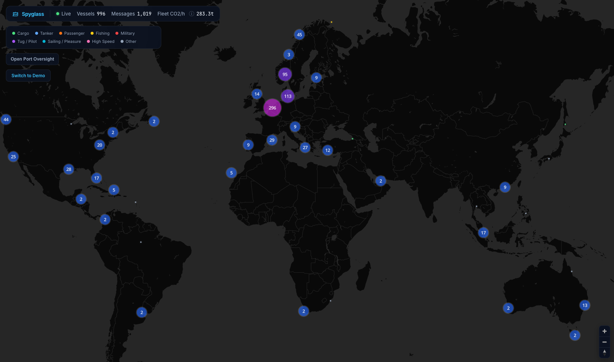
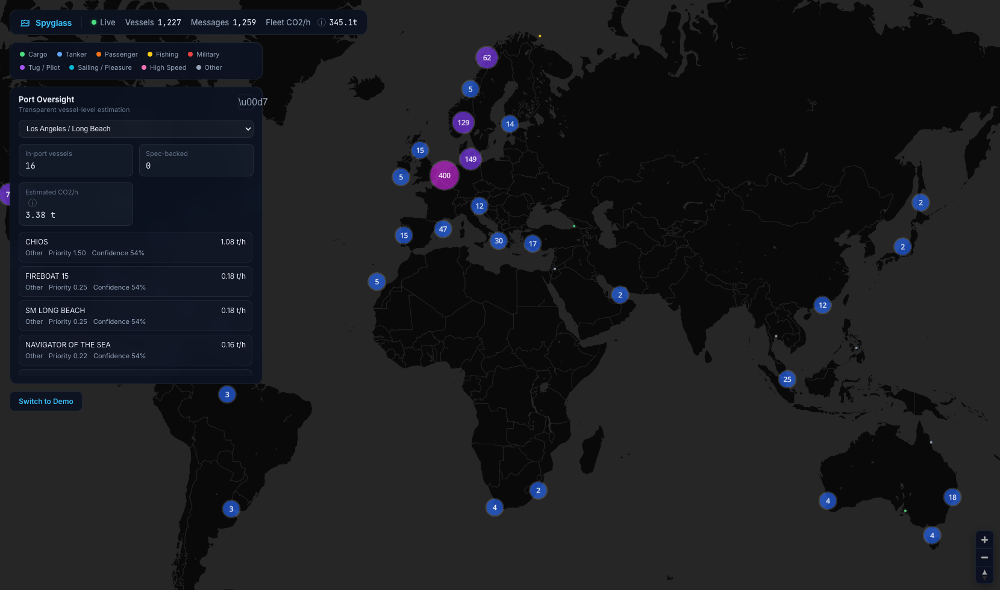

# Spyglass

Spyglass gives port and regulatory teams a clear, vessel-level view of maritime emissions.

Use it to answer three operational questions fast:
- Which ships are likely emitting the most right now?
- Where are they concentrated (by port zone)?
- How reliable is each estimate?




## Why teams use it

Shipping emissions data is often delayed, inconsistent, or self-reported. Spyglass provides an independent, real-time estimate layer on top of vessel movement data so teams can:

- Prioritize inspections and enforcement based on impact.
- Focus incentives where they reduce the most emissions.
- Explain decisions with transparent assumptions instead of black-box outputs.
- Communicate trends with a map-first, public-facing view.

## What you can do in the app

- **Track vessels globally in real time.**
  See active traffic as color-coded vessel categories on an interactive world map.

- **Open Port Oversight when needed.**
  View in-zone vessel count, estimated total `CO2/hour`, and a ranked top-emitter list for the selected port zone.

- **Drill into any vessel.**
  Inspect identity and voyage details plus estimated `CO2/hour`, confidence, fuel assumption, load factor, and power assumptions.

- **Triage with confidence-aware ranking.**
  Priority scoring highlights vessels with both high estimated impact and higher uncertainty, so teams can allocate analyst time effectively.

## How Emissions Are Estimated

Spyglass combines vessel movement + vessel characteristics to estimate hourly CO2 emissions.

1. Reads vessel speed, status, and position updates.
2. Uses vessel specs when available; otherwise applies class defaults.
3. Estimates engine load from speed and operating state.
4. Converts estimated energy use into `tonnes CO2/hour` using fuel factors.
5. Assigns a confidence score based on data freshness and completeness.

Confidence is a **data-quality signal**, not a legal certainty score.

## Getting started

```bash
npm install
npm run dev
```

Open [http://localhost:5173](http://localhost:5173).

## Live mode

Demo mode works immediately.

For live AIS traffic:
1. Create an API key at [aisstream.io](https://aisstream.io).
2. Click **Switch to Live Data** in the app.
3. Paste your key.

The key is stored locally in your browser.
